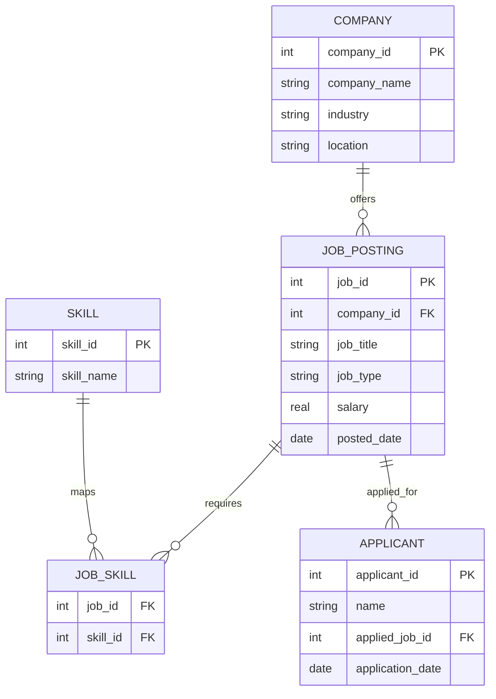

# Job Market Insights SQL Project  

## 📌 Project Overview  
This project explores **job market dynamics** using SQL.  
We simulate a relational database containing companies, job postings, required skills, and applicants.  
Through structured SQL queries, we uncover insights about **industries, skills demand, salaries, and applicant behavior**.  

The project is designed as a **portfolio-ready case study** to showcase SQL proficiency, data analysis, and database design.  

---

## 🗂️ Database Schema  

The database consists of **5 tables**:  

- **Company** → Information about employers (industry, location).  
- **Job_Posting** → Job details (title, type, salary, posting date).  
- **Skill** → Core skills (SQL, Python, etc.).  
- **Job_Skill** → Bridge table mapping jobs to required skills.  
- **Applicant** → Candidates applying for jobs.  

📊 **Entity Relationship Diagram (ERD):**  


# Dataset

- 5 companies (Technology, Healthcare, Energy, Agriculture, Finance)

- 6 job postings (Data Analyst, ML Engineer, etc.)

- 8 skills (SQL, Python, Excel, Finance, etc.)

- 8 applicants

 
| job_id | job_title                 | job_type  | salary | company  |
| ------ | ------------------------- | --------- | ------ | -------- |
| 1      | Data Analyst              | Full-time | 250000 | DataTech |
| 2      | Machine Learning Engineer | Full-time | 400000 | DataTech |
| 6      | Financial Analyst         | Remote    | 300000 | FinServe |

**This small dataset simulates real-world hiring dynamics while remaining easy to query.**

# Key SQL Queries & Insights
## 1. Top industries by job postings
```sql
SELECT c.industry, COUNT(*) AS job_count
FROM company c
JOIN job_posting j ON c.company_id = j.company_id
GROUP BY c.industry
ORDER BY job_count DESC;
```
| industry    | job_count |
| ----------- | --------- |
| Technology  | 2         |
| Healthcare  | 1         |
| Energy      | 1         |
| Agriculture | 1         |
| Finance     | 1         |

# ✅ Technology leads with the most postings.

## 2. Most in-demand skills
```sql
SELECT s.skill_name, COUNT(*) AS demand
FROM job_skill js
JOIN skill s ON js.skill_id = s.skill_id
GROUP BY s.skill_name
ORDER BY demand DESC;
```
| skill_name         | demand |
| ------------------ | ------ |
| SQL                | 3      |
| Excel              | 3      |
| Python             | 2      |
| Data Visualization | 1      |
| Machine Learning   | 1      |
| Public Health      | 1      |
| Agronomy           | 1      |
| Finance            | 1      |

 # ✅ SQL & Excel are the most required skills.

 
