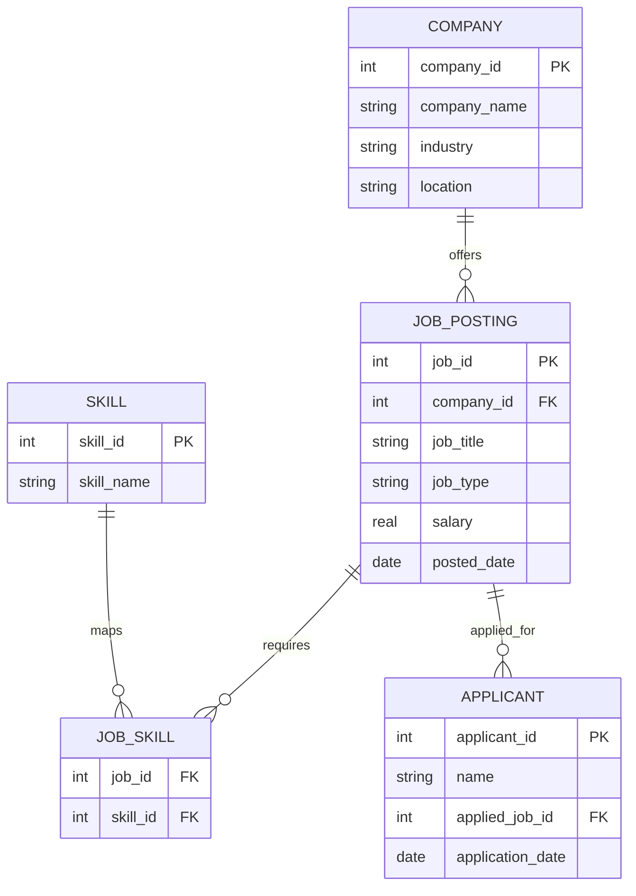

# Job Market Insights SQL Project  

## 📌 Project Overview  
This project explores **job market dynamics** using SQL.  
We simulate a relational database containing companies, job postings, required skills, and applicants.  
Through structured SQL queries, we uncover insights about **industries, skills demand, salaries, and applicant behavior**.  

The project is designed as a **portfolio-ready case study** to showcase SQL proficiency, data analysis, and database design.  

---

## 🗂️ Database Schema  

The database consists of **5 tables**:  

- **Company** → Information about employers (industry, location).  
- **Job_Posting** → Job details (title, type, salary, posting date).  
- **Skill** → Core skills (SQL, Python, etc.).  
- **Job_Skill** → Bridge table mapping jobs to required skills.  
- **Applicant** → Candidates applying for jobs.  

# 1. Create Tables
```sql
-- Company table
CREATE TABLE company (
  company_id INTEGER PRIMARY KEY AUTOINCREMENT,
  company_name TEXT NOT NULL,
  industry TEXT,
  location TEXT
);

-- Job postings
CREATE TABLE job_posting (
  job_id INTEGER PRIMARY KEY AUTOINCREMENT,
  company_id INTEGER,
  job_title TEXT,
  job_type TEXT, -- e.g. Full-time, Part-time, Remote
  salary REAL,
  posted_date DATE,
  FOREIGN KEY (company_id) REFERENCES company(company_id)
);

-- Skills
CREATE TABLE skill (
  skill_id INTEGER PRIMARY KEY AUTOINCREMENT,
  skill_name TEXT UNIQUE
);

-- Job-Skills mapping (many-to-many)
CREATE TABLE job_skill (
  job_id INTEGER,
  skill_id INTEGER,
  PRIMARY KEY (job_id, skill_id),
  FOREIGN KEY (job_id) REFERENCES job_posting(job_id),
  FOREIGN KEY (skill_id) REFERENCES skill(skill_id)
);

-- Applicants
CREATE TABLE applicant (
  applicant_id INTEGER PRIMARY KEY AUTOINCREMENT,
  name TEXT,
  applied_job_id INTEGER,
  application_date DATE,
  FOREIGN KEY (applied_job_id) REFERENCES job_posting(job_id)
);
```
# 2. Insert Data
```sql
-- Companies
INSERT INTO company (company_name, industry, location) VALUES
('DataTech Ltd', 'Technology', 'Lagos'),
('HealthFirst', 'Healthcare', 'Abuja'),
('EcoEnergy', 'Energy', 'Port Harcourt'),
('AgriPlus', 'Agriculture', 'Kano'),
('FinServe', 'Finance', 'Lagos');

-- Jobs
INSERT INTO job_posting (company_id, job_title, job_type, salary, posted_date) VALUES
(1, 'Data Analyst', 'Full-time', 250000, '2025-01-05'),
(1, 'Machine Learning Engineer', 'Full-time', 400000, '2025-02-01'),
(2, 'Public Health Officer', 'Contract', 180000, '2025-01-20'),
(3, 'Environmental Scientist', 'Full-time', 220000, '2025-02-15'),
(4, 'Agronomist', 'Full-time', 150000, '2025-03-01'),
(5, 'Financial Analyst', 'Remote', 300000, '2025-02-10');

-- Skills
INSERT INTO skill (skill_name) VALUES
('SQL'),
('Python'),
('Excel'),
('Machine Learning'),
('Public Health'),
('Data Visualization'),
('Agronomy'),
('Finance');

-- Job-Skills mapping
INSERT INTO job_skill (job_id, skill_id) VALUES
(1, 1), (1, 2), (1, 3), (1, 6),       -- Data Analyst
(2, 1), (2, 2), (2, 4),               -- ML Engineer
(3, 5), (3, 3),                       -- Public Health Officer
(4, 1), (4, 7),                       -- Environmental Scientist
(5, 7), (5, 3),                       -- Agronomist
(6, 1), (6, 8), (6, 3);               -- Financial Analyst

-- Applicants
INSERT INTO applicant (name, applied_job_id, application_date) VALUES
('Alice Johnson', 1, '2025-01-10'),
('Bob Smith', 1, '2025-01-15'),
('Chris Okoro', 2, '2025-02-05'),
('Damilola Ade', 3, '2025-01-25'),
('Efe Daniel', 4, '2025-02-20'),
('Grace Musa', 6, '2025-02-18'),
('Henry John', 2, '2025-02-07'),
('Ifeanyi Nwachukwu', 6, '2025-02-22');
```
📊 **Entity Relationship Diagram (ERD):**  


# Dataset

- 5 companies (Technology, Healthcare, Energy, Agriculture, Finance)

- 6 job postings (Data Analyst, ML Engineer, etc.)

- 8 skills (SQL, Python, Excel, Finance, etc.)

- 8 applicants

 
| job_id | job_title                 | job_type  | salary | company  |
| ------ | ------------------------- | --------- | ------ | -------- |
| 1      | Data Analyst              | Full-time | 250000 | DataTech |
| 2      | Machine Learning Engineer | Full-time | 400000 | DataTech |
| 6      | Financial Analyst         | Remote    | 300000 | FinServe |

**This small dataset simulates real-world hiring dynamics while remaining easy to query.**

# 3 Key SQL Queries & Insights
## 1. Top industries by job postings
```sql
SELECT c.industry, COUNT(*) AS job_count
FROM company c
JOIN job_posting j ON c.company_id = j.company_id
GROUP BY c.industry
ORDER BY job_count DESC;
```
| industry    | job_count |
| ----------- | --------- |
| Technology  | 2         |
| Healthcare  | 1         |
| Energy      | 1         |
| Agriculture | 1         |
| Finance     | 1         |

**✅ Technology leads with the most postings.**

## 2. Most in-demand skills
```sql
SELECT s.skill_name, COUNT(*) AS demand
FROM job_skill js
JOIN skill s ON js.skill_id = s.skill_id
GROUP BY s.skill_name
ORDER BY demand DESC;
```
| skill_name         | demand |
| ------------------ | ------ |
| SQL                | 3      |
| Excel              | 3      |
| Python             | 2      |
| Data Visualization | 1      |
| Machine Learning   | 1      |
| Public Health      | 1      |
| Agronomy           | 1      |
| Finance            | 1      |

  **✅ SQL & Excel are the most required skills.**

## 3. Highest-paying job roles
```sql
SELECT job_title, AVG(salary) AS avg_salary
FROM job_posting
GROUP BY job_title
ORDER BY avg_salary DESC
LIMIT 5;
